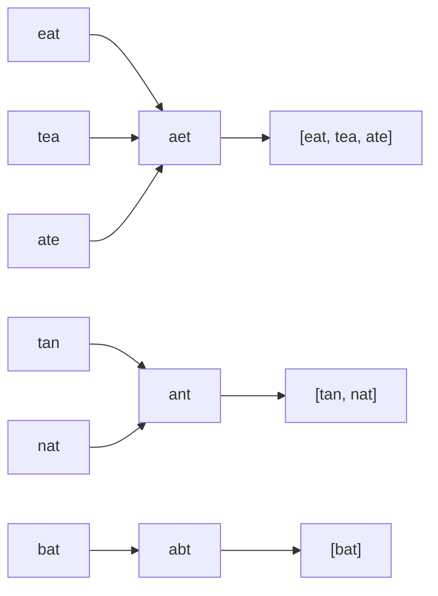

# Задача 2. Anagrams

Дан список слов. Нужно сгруппировать слова так, чтобы в одной группе оказались все анаграммы.

| Вход | Выход |
|---|---|
| `strs = ["eat", "tea", "tan", "ate", "nat", "bat"]` | `[["bat"], ["nat", "tan"], ["ate", "eat", "tea"]]` |

## Файлы и запуск

| Файл | Что внутри |
|---|---|
| `main.py` | решение `group_anagrams`, упорядочивание для вывода `sort_groups`, разбор ввода и запуск |
| `test_anagrams.py` | тесты |
| `README.md` | объяснение, сложность, визуализация |

```
python main.py              # ввод слов с клавиатуры
python -m unittest -v       # тесты, запускать из папки задачи
```

Пример запуска:

```
Введите слова через пробел: eat tea tan ate nat bat
[['bat'], ['nat', 'tan'], ['ate', 'eat', 'tea']]
```

Ограничение на алфавит - решение для консольного ввода, в условии его нет. Ввод ограничен
строчными латинскими буквами, как в примере. Если введены заглавные буквы, цифры, знаки
препинания, кириллица или пустая строка, программа пишет, что не так, а не падает. Сама функция
`group_anagrams` работает с любыми строками, включая кириллицу и пустую строку.

## Объяснение решения

### Идея

Два слова являются анаграммами, если состоят из одних и тех же букв в одинаковом количестве
и отличаются только порядком. Если в каждом слове расставить буквы по алфавиту, у анаграмм
получится одна и та же строка, а у остальных слов строки будут разные. Например, `eat`, `tea`
и `ate` превращаются в `aet`, а `tan` и `nat` превращаются в `ant`.

Эту строку удобно взять ключом словаря. Алгоритм проходит по списку слов один раз. Для каждого
слова он считает ключ и добавляет слово в список `groups[key]`. `setdefault` заводит пустой
список, если ключ встретился впервые.

### Почему это правильно

**Ключ однозначно задает набор букв.** Отсортированная строка показывает, какие буквы и сколько
раз входят в слово. Значит ключи двух слов равны тогда и только тогда, когда слова - анаграммы.

**Группы.** После прохода в каждом списке лежат ровно все анаграммы одного набора букв:
слова с одинаковым ключом попали в одну группу, слова с разными ключами - в разные.

**Порядок.** Словарь в Python сохраняет порядок вставки, поэтому группы идут в порядке первого
появления ключа, а слова внутри группы - в порядке входного списка. В условии порядок групп
не важен. В примере же слова в группе стоят по алфавиту, а группы упорядочены по возрастанию
размера. Чтобы вывод совпадал с примером буквально, `main` дополнительно вызывает `sort_groups`.
На саму группировку эта функция не влияет.

### Граничные случаи

Отдельных веток для них не нужно:

- пустой список дает пустой ответ;
- пустая строка получает ключ `''` и образует свою группу (это касается функции `group_anagrams`; через консоль пустое слово не ввести, потому что слова разделяются пробелами);
- одинаковые слова имеют одинаковый ключ и попадают в одну группу, ни одно не теряется;
- слова разной длины не смешиваются, потому что их ключи тоже разной длины;
- слова из тех же букв, но в другом количестве (`aab` и `abb`), не смешиваются, потому что их ключи `aab` и `abb` разные.

## Оценка сложности

Обозначения: `n` - количество слов, `k` - длина самого длинного слова.

| | `group_anagrams` | `sort_groups` |
|---|---|---|
| время | O(n * k * log k) в среднем | O(n * k * log n) |
| память | O(n * k) | O(n) |

### Время

Для каждого слова:

| Операция | Стоимость |
|---|---|
| `sorted(word)` | O(k * log k) |
| `"".join(...)` | O(k) |
| поиск и вставка в словарь | в среднем O(1) обращений, каждое требует хеша и сравнения строки длины `k`, итого O(k) |
| `append` | амортизированно O(1) |

На одно слово уходит O(k * log k), на весь список O(n * k * log k).

`sort_groups` нужен только для вывода, но его стоимость тоже можно оценить:

- сортировки внутри групп в сумме дают O(n * log n) сравнений строк;
- сортировка групп делает O(g * log g) <= O(n * log n) сравнений, где `g` - число групп. Две группы одного размера сравниваются только до первых слов, потому что разные группы не могут начинаться с одного и того же слова;
- каждое сравнение строк стоит O(k), итого O(n * k * log n).

### Память

- Словарь хранит не больше `n` ключей длины до `k`: O(n * k).
- Группы хранят ссылки на все `n` слов, а не копии. Это проверяет тест `test_returns_same_objects`.
- Временный список из `sorted(word)` занимает O(k) и сразу освобождается.
- `sort_groups` создает новые списки ссылок на те же слова: O(n).

### Можно ли быстрее

Если алфавит заранее известен и мал, например только строчные латинские буквы, ключом можно
взять кортеж из 26 счетчиков букв вместо отсортированной строки. Подсчет букв стоит O(k), и
группировка становится O(n * (k + 26)) = O(n * k) по времени, а ключи занимают O(26 * n) вместо
O(n * k). Но условие алфавит не фиксирует, а для произвольных символов такой кортеж не построить.
Кроме того, для коротких слов выигрыш незаметен, а сортировка понятнее, поэтому в решении оставлен
ключ `"".join(sorted(word))`: он работает для любого алфавита.

## Визуализация работы алгоритма

Пример из условия: `["eat", "tea", "tan", "ate", "nat", "bat"]`. Все строки таблицы
проверяет тест `TestReadmeExample.test_states`.

| Шаг | Слово | `sorted(word)` | Ключ | Ключ новый? | Состояние `groups` после шага |
|---:|---|---|---|:---:|---|
| - | - | - | - | - | `{}` |
| 1 | `eat` | `a e t` | `aet` | да | `{aet: [eat]}` |
| 2 | `tea` | `a e t` | `aet` | нет | `{aet: [eat, tea]}` |
| 3 | `tan` | `a n t` | `ant` | да | `{aet: [eat, tea], ant: [tan]}` |
| 4 | `ate` | `a e t` | `aet` | нет | `{aet: [eat, tea, ate], ant: [tan]}` |
| 5 | `nat` | `a n t` | `ant` | нет | `{aet: [eat, tea, ate], ant: [tan, nat]}` |
| 6 | `bat` | `a b t` | `abt` | да | `{aet: [eat, tea, ate], ant: [tan, nat], abt: [bat]}` |

Та же картина в виде схемы. Каждое слово переходит в свой ключ, а ключ собирает группу:



`group_anagrams` возвращает группы в порядке появления ключей:

```
[['eat', 'tea', 'ate'], ['tan', 'nat'], ['bat']]
```

`sort_groups` сортирует слова внутри групп и упорядочивает группы по размеру (1, 2, 3). Получается ответ из условия:

```
[['bat'], ['nat', 'tan'], ['ate', 'eat', 'tea']]
```

## Тесты

`test_anagrams.py`, 23 теста в четырех классах. Запуск: `python -m unittest -v`.

| Класс | Что проверяется |
|---|---|
| `TestGroupAnagrams` | пример из условия буквально; порядок групп и слов без `sort_groups`; пустой список, одно слово, пустая строка (в том числе две пустые строки), повторяющиеся слова; все слова - анаграммы; ни одной пары; одинаковые буквы в разном количестве (`aab`/`abb`); общий набор букв при разной длине; в группах лежат сами объекты входа (`assertIs`); входной список не меняется |
| | оракул: 300 случайных списков, ответ сверяется с независимой группировкой через попарное сравнение `Counter`, включая порядок |
| | инварианты на случайных списках: каждое слово ровно в одной группе, пустых групп нет, внутри группы все анаграммы, у разных групп разные наборы букв; большой вход - 10 000 перемешанных слов длины 100 из 10 наборов букв |
| `TestSortGroups` | порядок по размеру и по словам; пустой ответ; исходные группы не меняются |
| `TestReadmeExample` | все 6 состояний `groups` из таблицы визуализации |
| `TestInput` | разбор строк, в том числе мусор: заглавные буквы, цифры, запятая, кириллица, `café`; `read_words` и `main` с подменой ввода через `unittest.mock.patch`; некорректный ввод не роняет программу |
